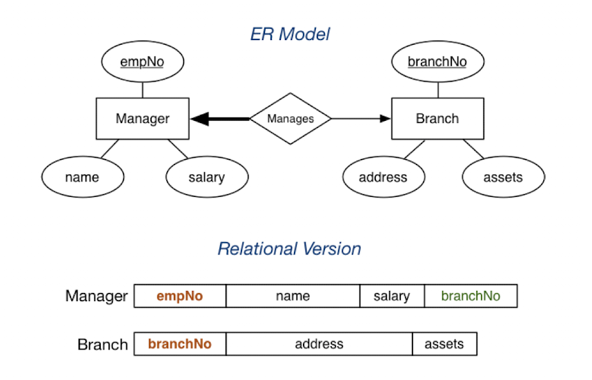

Aims of data modelling
* describe what information is contained in the database
* describe relationships between data items
* describe constraints on data

Data modelling is a design process
* converts requirements into a data model

Kinds of data models:
* logical: abstract, for conceptual design (e.g. ER, UML)
* physical: record-based, for implementation (e.g. relational, SQL)  


The most important aspects of a design:
* correctness
* completeness
* consistency

Potential inadquencies in a design:
* omits information that needs to be included
* contains redundant information
* leads to an inefficient implementation
* violate syntatic or semantic rules of a data model

## **ER Models**

An entity-relationship model has three major constructs:
* attribute
* entity
* relationship

An ER diagram consists of:
* a collection of entity set ("entity") definitions
* a collection of relationship set ("relationship") definitions
* attributes associated with entity and relationship sets
* connections between entity and relationship sets

  

Attributes

  

Keys
* Primary key: unique attribute in an entity set
* Candidate key: potential key
* Discriminator: weak key

  

Degree
* Number of entities involved in a relationship

  

Cardinality
* Number of associated entities on each side of relationship

 

Participation
* partial: entity may or may not be involved in relationship
* total (bold): entity must be involved in relationship


Subclasses and inheritance


Weak entities
* Weak entities results in weak relationships (?)


## **Relational Model**

A relational data model describes the world as a collection of inter-connected relations (or tables). Each relation has:
* a name
* a set of attributes, each having:
    * a name
    * a domain (set of allowed values)
        * which are atomic values (e.g. integer, string, date)
        * may be `NULL`
* a key

Consider relation R:
* Relation schema of R: `R(a_1:D_1, a_2:D_2, ..., a_n:D_n`
* Tuple of R: an element of `D_1 * D_2 * ... * D_n` (a list of values or a row in the table)
* Instance of R: subset of `D_1 * D_2 * ... * D_n` (a set of tuples)

Example of a relation: `Account(branchName, accountNo, balance)`
* Instance of this relation:
```
{
  (Sydney, A-101, 500),
  (Coogee, A-215, 700),
  (Parramatta, A-102, 400),
  (Rouse Hill, A-305, 350),
  (Brighton, A-201, 900),
  (Kingsford, A-222, 700)
  (Brighton, A-217, 750)
}
```
* As a table:

 

Constraints
* Constraints are logical statements:
    * domain constraints: limit the set of values that attributes can take
        * e.g. age must be `0 <= age <= 100`
    * key constraints: identify attributes that uniquely identify tuples
        * e.g. `Student(id, ...)` is guaranteed unique
    * entity integrity constraints: require keys to be fully-defined
        * e.g. `Class(Mon, 2pm, Lyre, ...)` is well defined, but `Class(NULL, 2pm, Lyre, ...)` is not well defined
    * referential integrity constraints: require references to other tables to be valid
        * e.g.  
 

## **ER Model -> Relational Model**

Correspondences between relational and ER data models:
* entity set (ER) = relation (Rel) 
* relationship (ER) = relation (Rel)
* entity (ER) = tuple (Rel)
* attribute (ER) = attribute (Rel)

Differences between relational and ER models:
* Relation model uses relations to model entities and relationships
* Relation model has no composite or multi-valued attributes (only atomic)
* Relation model has no object-oriented notions (e.g. subclasses, inheritance)

Example:  
 

Weak entity example:  
 

1:N Relationship example:  
 

1:1 Relationship example:
* Any relation may be chosen to house the foreign key  
 

Multi-valued entities example:  


Mapping subclasses example:  


