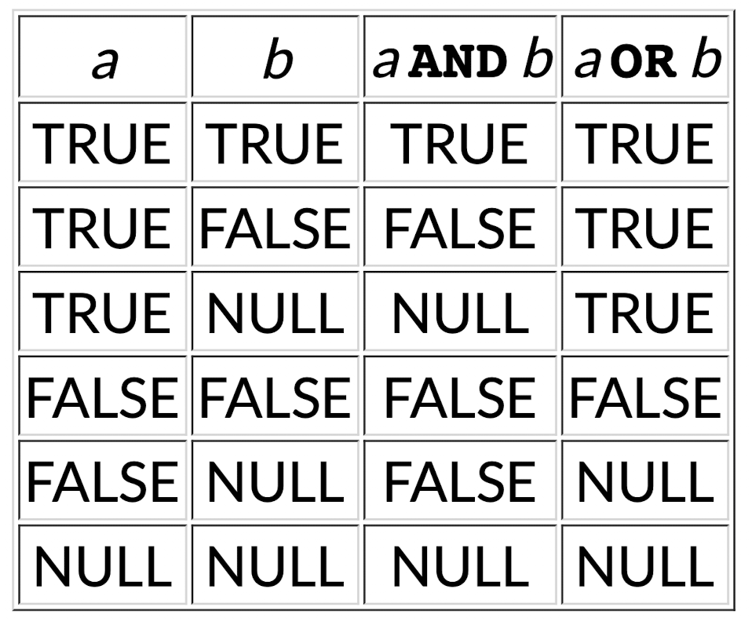
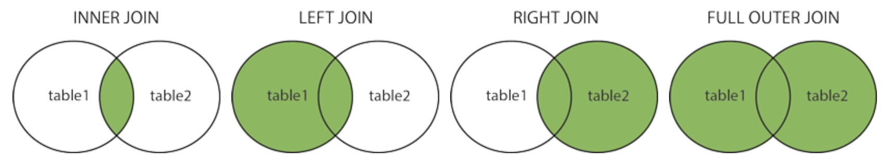

* SQL (Structured Query Language) is a programming language used to query a database.

### Types
* Strings
    * `'...'` are constant strings e.g. `'a'`, `'abc123'`, `'John''s bag'`
    * `"..."` allow non-alpha characters and make id's case sensitive
    * Types: `char(n)`, `varchar(n)`, `TEXT`
* Numbers
    * Types: `INTEGER`, `FLOAT`
* Dates
    * Types: `DATE`, `TIME`, `TIMESTAMP`, `INTERVAL`
* Operators
    * Types: `=`, `<>`, `<`, `<=`, `>`
        * `<>` = `!=`
        * `<`, `>`, etc. can be used for dictionary comparisons
    * Types: `AND`, `OR`, `NOT`
* Logical type
    * `TRUE`
    * `FALSE`  
    
* User defined types
    * `CREATE DOMAIN <Name> AS <Type> CHECK (<Constraint>)`
        * e.g.
        * `CREATE DOMAIN Grade AS char(2)`
        * `CHECK (value in ('FL','PS','CR','DN','HD'));`
    * `CREATE TYPE <Name> AS ENUM ('Label1', 'Label2', ...)`
        * e.g. `CREATE TYPE Grade AS ENUM ('FL','PS','CR','DN','HD');`

### Pattern Matching
* Via `LIKE` and `NOT LIKE`
    * e.g. `name LIKE 'Ja%`
* `%` = `.*` in regex
* `_` = `.` in regex
* PostgreSQL supports case-insensitive matching via `ILIKE`
* PostgreSQL supports Regex pattern matching via `~` and `!~` and `~*` (case-insensitive)
    * e.g. `name ~ '^Ja'`
* <a href="https://ridho-y.github.io/comp2041/regexNotes.html" target="_blank">Resource: COMP2041 Regex Notes</a> 

### String Manipulation
* `str1 || str2` allows concatenation
* `lower(str1)`
* `substring(str1,start,count)`

### Arithmetic Operations
* Operators: `+ - * / abs ceil floor power sqrt sin`
* `count(attr)` 
    * this can actually be applied to columns of non-numbers
* `sum(attr)`
* `avg(attr)`
* `min(attr)`
* `max(attr)`

### `NULL`
* Test for `NULL` using: `x IS NULL` or `x IS NOT NULL`
* `coalesce(val1, val2, val3)` returns first non-null value
* `nullif(val1, val2)` returns `NULL` if `val1` equal to `val2`
    * can be used to 'inverse' coalesce

### Tables
```sql
CREATE TABLE TableName (
    attribute1 domain1 constraints1,
    attribute2 domain2 constraints2,
    ...
    table-level constraints, ... 
)
```
* Example:

```sql
CREATE DOMAIN GenderType AS
       char(1) CHECK (value in ('M','F', 'X'));

CREATE TABLE Students (
    zid     serial,
    family  varchar(40),
    given   varchar(40) NOT NULL,
    d_o_b   date NOT NULL,
    gender GenderType,
    degree  integer,
    PRIMARY KEY (zid),
    FOREIGN KEY (degree) REFERENCES Degrees(did)
);
```

### Query Commands
* `SELECT <projection list to display>`
    * `AS` - renaming attributes, e.g. `mnaf as name`
* `FROM <relations/joins>`
    * `JOIN` (Inner Join) - Join two tables based on a common attribute  
    * `LEFT/RIGHT OUTER JOIN` - Adds all tuples of left/right table and adds common tuples of right/left table
    * `FULL OUTER JOIN` - Adds all tuples of left and right table
    
* `WHERE <condition>`
* `GROUP BY <grouping attributes>`
    * Groups rows that have the same values into summary rows
    * Often used with aggregate functions `COUNT`, `MAX`, `MIN`, `SUM`, `AVG`
* `HAVING <group condition>`
    * Like `WHERE`, but can be used with aggregate functions, i.e for group filtering
* `ORDER BY <attribute> [DESC]` (descending = `DESC`)
* `LIMIT <integer>`

### Constraints
* `UNIQUE`, `NOT NULL`, `CHECK (<constraint>)`, `PRIMARY KEY`, `FOREIGN KEY`, `DEFAULT <value>`, `CREATE INDEX` (?)

### Managing Tables
* `CREATE TABLE <table name> (<attributes + constraints>)`
* `ALTER TABLE <table name> (<table schema changes>)`
* `DROP TABLE <table name> [CASCADE]`
    * `CASCADE` also drops objects which depend on the table
* `TRUNCATE TABLE <table name> [CASCADE]`
* `INSERT INTO <table name> (<attributes>) VALUES <tuple(s)>`
* `DELETE FROM <table name> WHERE <condition>`
* `UPDATE <table name> SET <attribute changes> WHERE <condition>`

### Insertion
```sql
INSERT INTO RelationName VALUES (val1, val2, val3, ...)

INSERT INTO RelationName(Attr1, Attr2, ...) VALUES (valForAttr1, valForAttr2, ...)

INSERT INTO RelationName
VALUES Tuple1, Tuple2, Tuple3, ...
```

### Deletion
```sql
DELETE FROM Relation WHERE Condition
```

### Update
```sql
UPDATE RelationName
SET ToSet
WHERE Condition
```

### Views
```sql
CREATE VIEW <name>
AS
<query>
```
* Updates to the view, updates the original table
* Avoid views via:
    ```sql
    WITH CourseMarksWithAvg AS
        (SELECT course, student, mark,
                avg(mark) OVER (PARTITION BY course)
        FROM   Enrolments)

    SELECT course, student, mark, avg
    FROM   CourseMarksWithAvg
    WHERE  mark < avg;
    ```

### Tuple Dot Syntax
* `SELECT r1.a, r2.b FROM R r1, R r2 WHERE r1.a = r2.a`

### Sets
* Operations: `UNION`, `INTERSECT`, `EXCEPT`
    * E.g. `(1,2,3) UNION (2,3,4)` yields `(1,2,3,4)`
    * E.g. `(1,2,3) UNION ALL (2,3,4)` `(1,2,3,2,3,4)`
    * E.g.  
        ```sql
        SELECT beer
        FROM   Sells
        WHERE  price >=
        ALL(SELECT price FROM sells);
        ```
* Operations: `ANY`, `ALL`
    * E.g. `SELECT beer FROM Sells WHERE price >= ALL(SELECT price FROM sells);`

### Partitions
* Like `GROUP BY`, however `PARTITION` groups by group-based value(s)
* E.g. Show each city with daily temperature and temperature range, result is `Result(city, date, temperature, lowest, highest)`
    ```sql
    SELECT city, date, temperature
        min(temperature) OVER (PARTITION BY city) as lowest,
        max(temperature) OVER (PARTITION BY city) as highest
    FROM   Weather;
    ```


